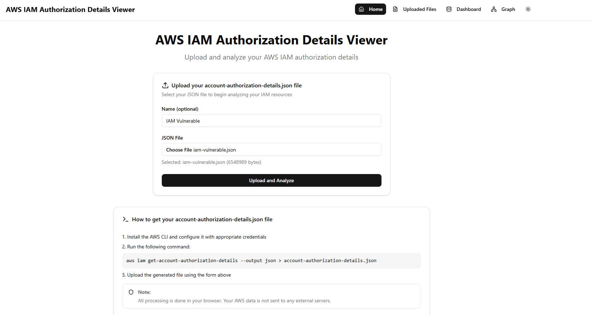
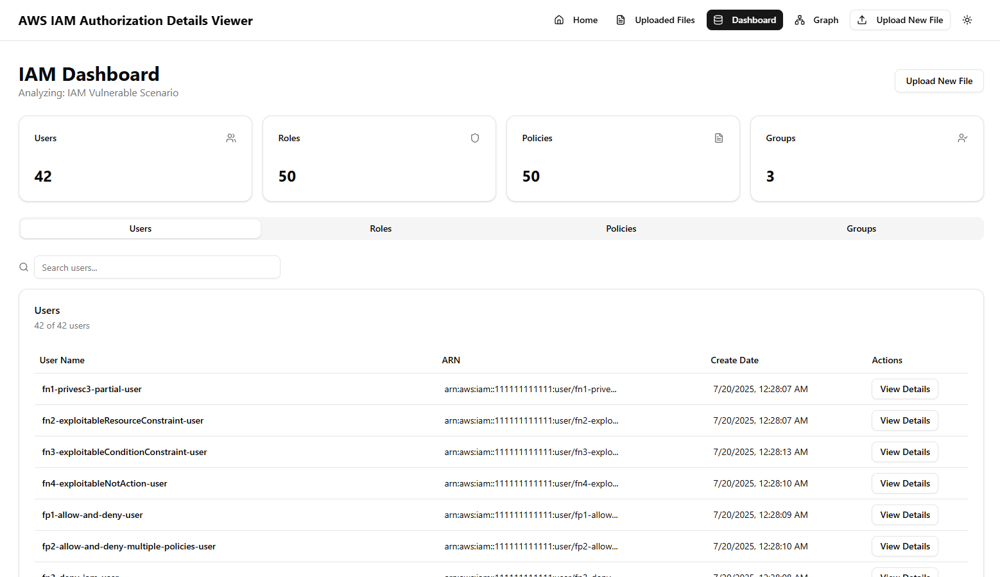
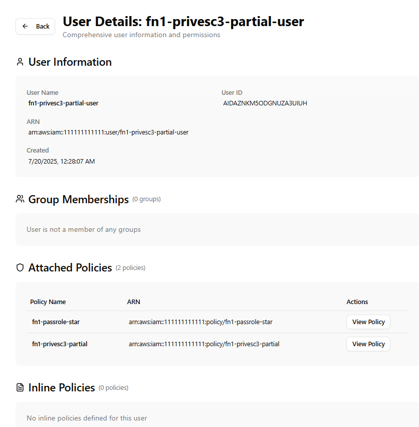
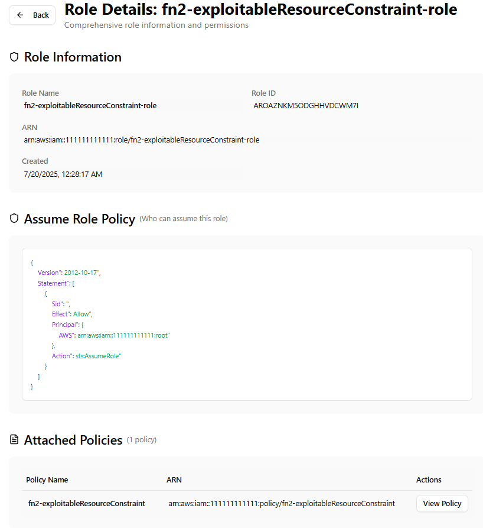
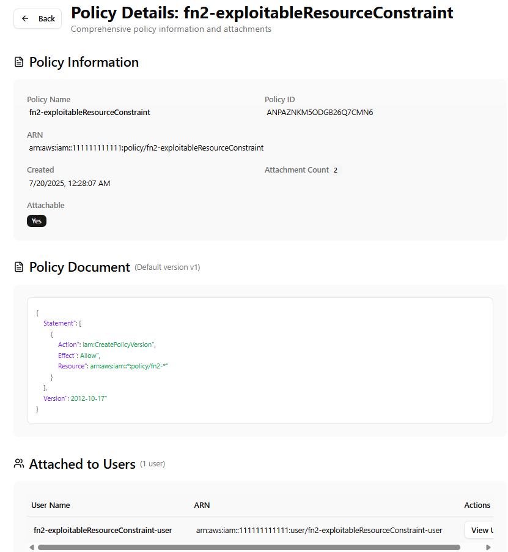
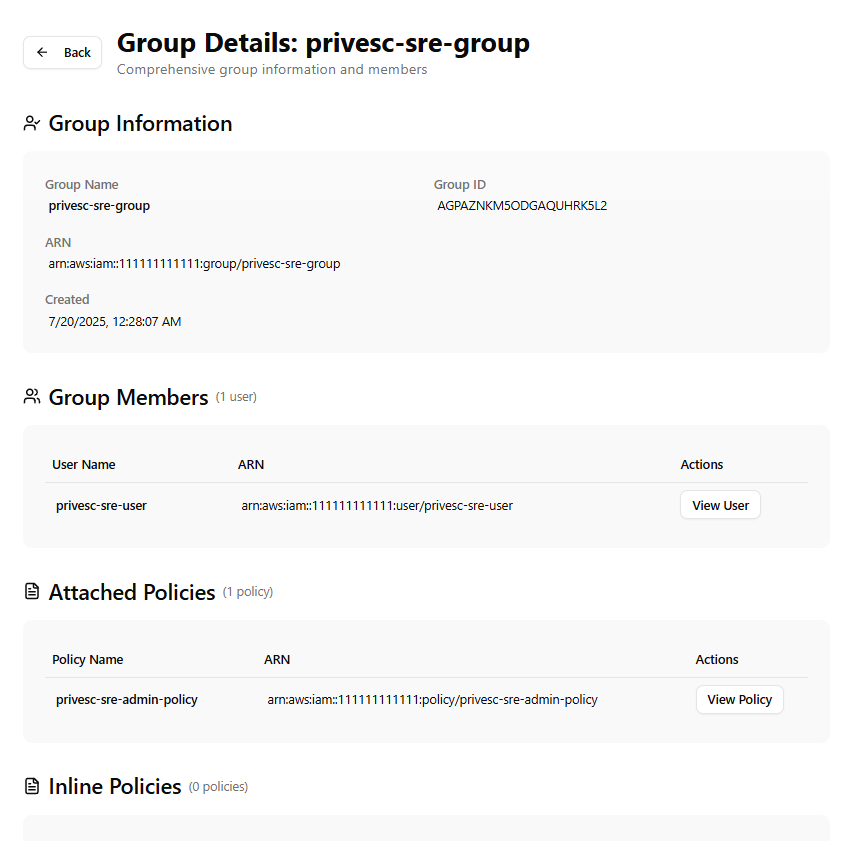
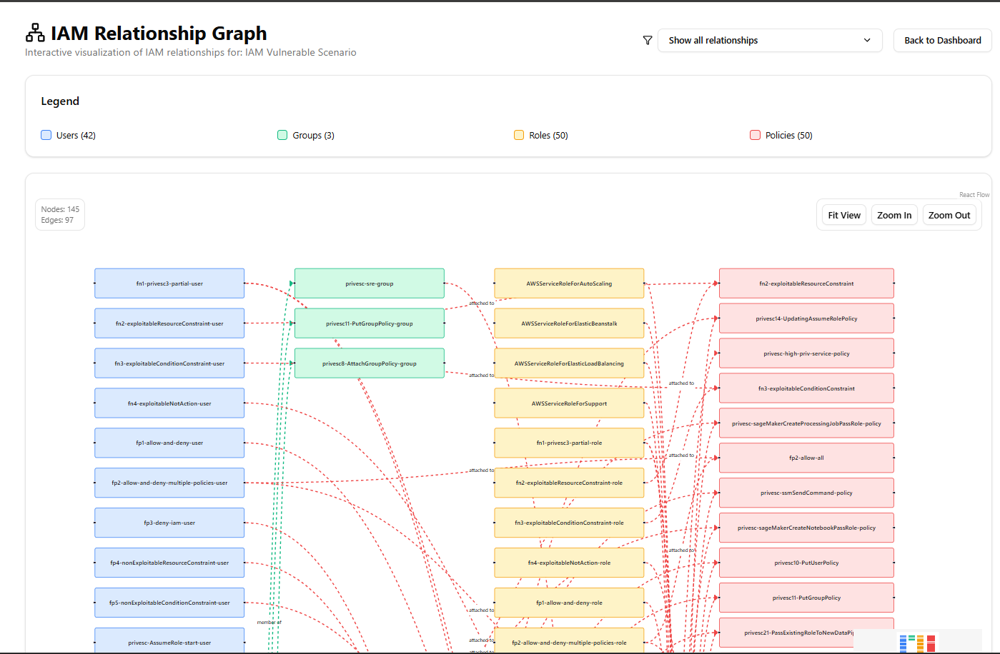
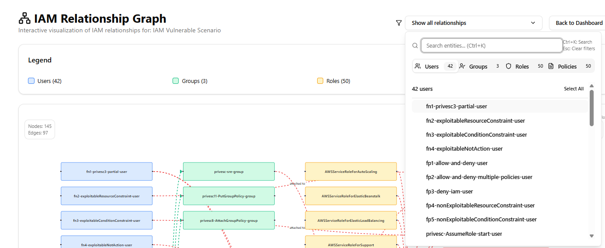
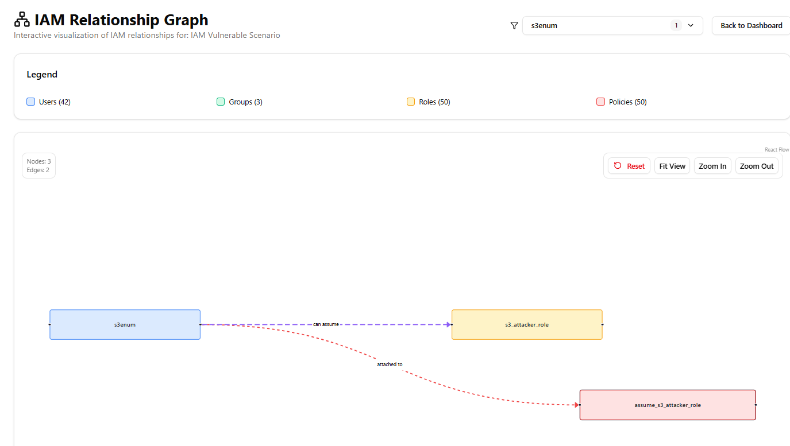
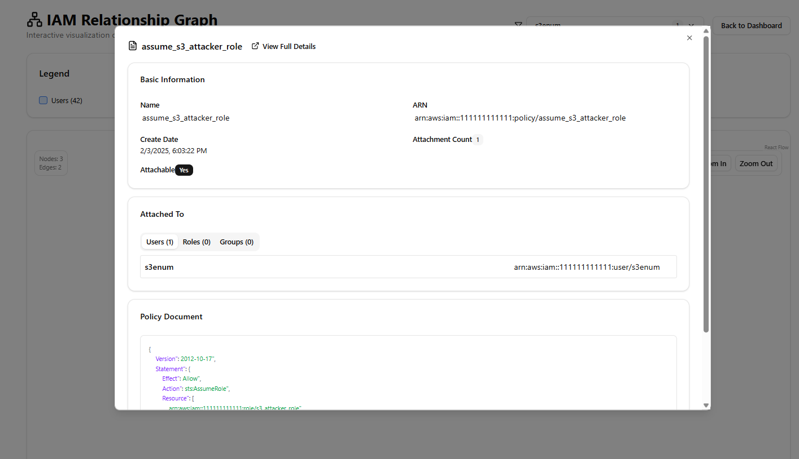

# AWS IAM Viewer

A modern Next.js web application that allows you to upload and analyze AWS IAM `account-authorization-details.json` files to better understand your AWS IAM configuration and relationships.

## Table of Contents

- [Features](#features)
- [Screenshots](#screenshots)
- [Installation](#installation)
- [Usage](#usage)
- [Security](#security)
- [License](#license)

## Features

- **File Upload**: Upload and parse AWS IAM `account-authorization-details.json` files
- **User Management**: View comprehensive information about IAM users, roles, policies, and groups
- **Relationship Mapping**: Explore relationships between IAM entities with interactive graphs
- **Role Analysis**: See which roles a user can assume and their trust relationships
- **Policy Inspection**: View detailed policy documents and trust relationships
- **Search & Filter**: Search and filter IAM resources for better analysis
- **Visual Graphs**: Interactive graph visualization of IAM relationships

---

## Screenshots

### Home Page


*The main landing page with file upload functionality and project overview*

### Dashboard Overview


*Dashboard showing IAM statistics and quick access to all resources*

### User Details


*Detailed view of IAM user information including attached policies, groups, inline policy and assumable roles*

### Role Details


*Role information display with assume role policy, attached policies, and inline policies*

### Policy Details


*Policy document viewer with syntax highlighting and attachment information*

### Group Details


*Group management view showing group members, attached policies, and inline policies*

### Graph Visualization

#### Default View


*Viasualize all IAM entities and their relationships*

#### Filtering Capabilities


*Graph filtering interface to focus on specific IAM resources or relationships*

#### Filtered Results


*Filtered graph view displaying only selected IAM entities and connections*

#### Node Details


*Detailed node information panel showing specific IAM resource properties and connections*

## Installation

### Prerequisites

- [Node.js](https://nodejs.org/) (v18 or higher)
- [Docker](https://www.docker.com/) (optional, for containerized deployment)
- [AWS CLI](https://aws.amazon.com/cli/) (for generating IAM data)

### Option 1: Docker (Recommended)

1. **Clone the repository**:

   ```bash
   git clone https://github.com/kabinet01/aws_iam_viewer
   cd aws_iam_viewer
   ```

2. **Run with Docker Compose**:

   ```bash
   docker compose up --build
   ```

3. **Access the application**:
   Open your browser and navigate to `http://localhost:3000`

### Option 2: Local Development

1. **Clone the repository**:

   ```bash
   git clone https://github.com/kabinet01/aws_iam_viewer
   cd aws_iam_viewer/aws-iam-viewer
   ```

2. **Install dependencies**:

   ```bash
   npm install
   ```

3. **Build the application**:
 
   ```bash
   npm run build
   ```

4. **Start the development server**:

   ```bash
   npm run dev
   ```

5. **Access the application**:
   Open your browser and navigate to `http://localhost:3000`

## Usage

### Getting Your AWS IAM Authorization Details

1. **Install and configure AWS CLI** with appropriate credentials:

   ```bash
   aws configure
   ```

2. **Generate the IAM authorization details**:

   ```bash
   aws iam get-account-authorization-details --output json > account-authorization-details.json
   ```

3. **Upload the file** using the web interface
A sample data from [iam-vulnerable](https://github.com/BishopFox/iam-vulnerable) is attached at the sample_data folder.

### Using the Application

1. **Upload File**: Drag and drop or select your `account-authorization-details.json` file
2. **Explore Dashboard**: View overview statistics and quick access to resources
3. **Browse Resources**: Navigate through users, roles, groups, and policies
4. **Analyze Relationships**: Use the graph view to understand IAM entity relationships
5. **Search & Filter**: Use the search functionality to find specific resources
6. **View Details**: Click on any resource to see detailed information

### Key Features

- **Dashboard**: Overview of your IAM configuration with statistics
- **User Management**: Detailed user information with attached policies and groups
- **Role Analysis**: Role details including trust relationships and attached policies
- **Group Management**: Group membership and attached policies
- **Policy Inspection**: Full policy document viewing with syntax highlighting
- **Graph Visualization**: Interactive network graph showing IAM relationships
- **Search**: Quick search across all IAM resources

## Security

**Important**: All processing is done locally in your browser. Your AWS data is **never sent to any external servers**.

- Client-side processing only
- No data transmission to external services
- Your AWS credentials remain secure
- No server-side storage of sensitive information

## License

This project is licensed under the MIT License - see the [LICENSE.txt](LICENSE.txt) file for details.
